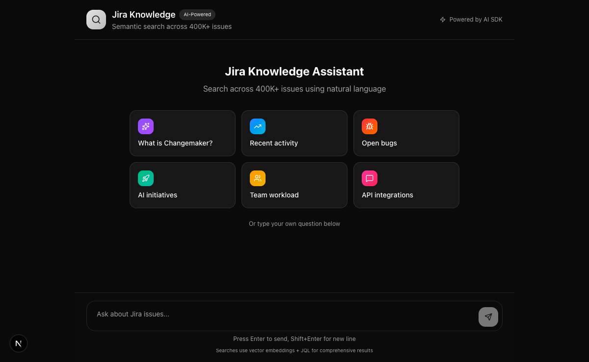
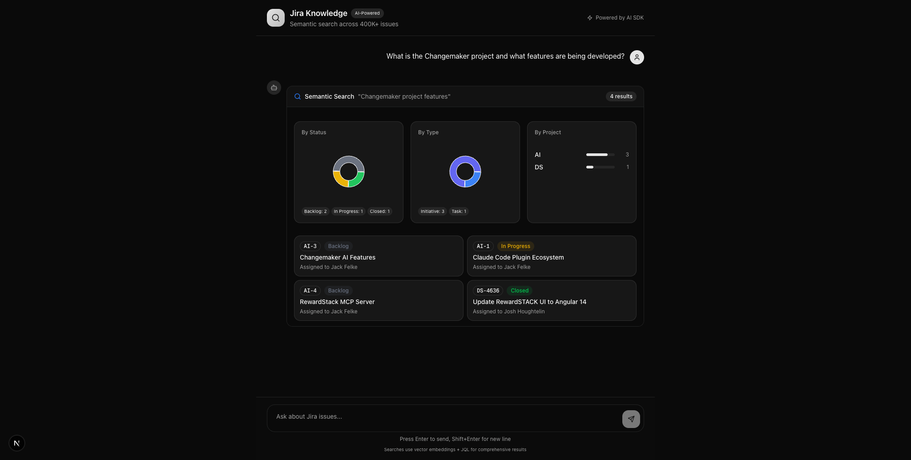
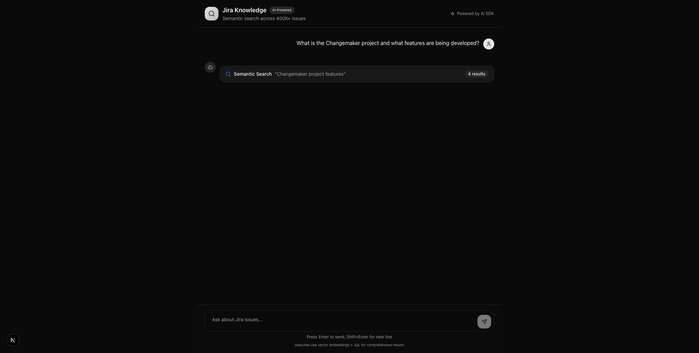
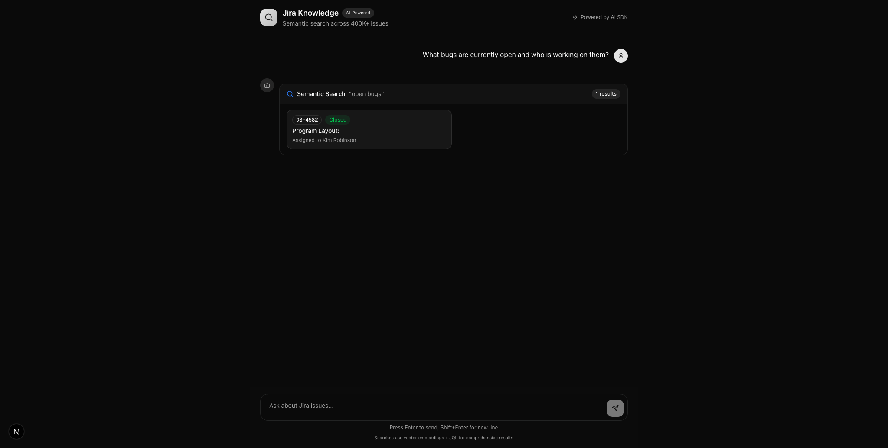
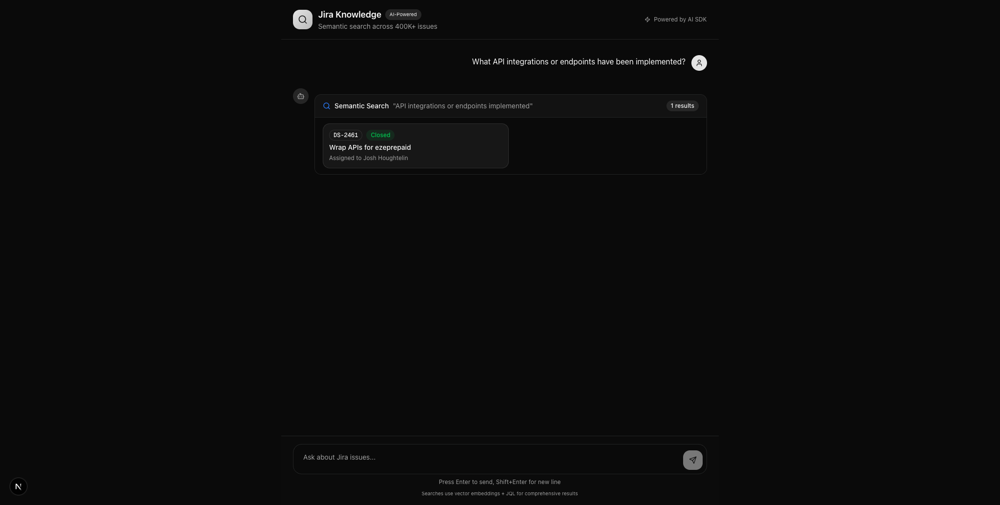

# Jira Knowledge UI - Sprint Status

> Single source of truth for the Jira Knowledge chat interface

## Current State

**Status:** MVP - Needs Work
**Last Updated:** 2026-01-23
**Stack:** Next.js 16.1.4 + Vercel AI SDK v3 + FastAPI + LanceDB

## Screenshots

### Landing Page


### Search Results (Expanded)


### Search Results (Collapsed)


## Features

### Completed

- [x] **Chat Interface** - Conversational UI with AI SDK v3 `useChat` hook
- [x] **Semantic Search** - Vector search via LanceDB embeddings
- [x] **JQL Search** - Direct Jira query support
- [x] **Tool Invocations** - Visible intermediate steps showing search progress
- [x] **Expand/Collapse** - Toggle visibility of tool results
- [x] **Stats Visualization** - Pie charts (By Status, By Type) and bar charts (By Project)
- [x] **Issue Cards** - Rich cards with status badges, assignees, and direct Jira links
- [x] **Starter Prompts** - Quick-start buttons for common queries
- [x] **Dark Theme** - Polished dark mode UI

### QC Results - Honest Assessment

| Query | Results | Verdict | Issues |
|-------|---------|---------|--------|
| What is Changemaker? | 4 | FAIL | No AI answer, 2/4 results irrelevant (Claude Plugin, Angular 14) |
| Recent activity | 1 | FAIL | Returns CLOSED issue, no dates, wrong tool (should use JQL) |
| Open bugs | 1 | FAIL | Returns CLOSED issue, not even a Bug type |
| AI initiatives | 7 | PARTIAL | Best result but still no AI summary text |
| Team workload | 0 | FAIL | **500 ERROR** - JQL fails silently, no error shown |
| API integrations | 1 | FAIL | CLOSED issue, weak relevance |

### UI Components Working

| Component | Status | Notes |
|-----------|--------|-------|
| Expand/Collapse | PASS | Smooth animation, state persists |
| Stats charts | PASS | Renders for 4+ results |
| Issue cards | PASS | Links work, status badges display |
| Starter prompts | PASS | Buttons trigger queries |

### Query Screenshots

#### Changemaker (4 results - 2 irrelevant)


#### AI Initiatives (7 results - best query)


#### Open Bugs (1 CLOSED result - wrong)


#### API Integrations (1 CLOSED result)


#### Collapsed State


## Architecture

```
┌─────────────────┐     ┌─────────────────┐     ┌─────────────────┐
│   Next.js UI    │────>│  FastAPI        │────>│   LanceDB       │
│   (AI SDK v3)   │     │  /api/*         │     │   Vector Store  │
└─────────────────┘     └─────────────────┘     └─────────────────┘
        │                       │
        │                       v
        │               ┌─────────────────┐
        └──────────────>│   OpenAI        │
                        │   gpt-4o-mini   │
                        └─────────────────┘
```

## Key Files

| File | Purpose |
|------|---------|
| `web/src/app/api/chat/route.ts` | AI SDK streaming endpoint with tools |
| `web/src/components/chat/chat-container.tsx` | Main chat component |
| `web/src/components/chat/chat-message.tsx` | Message rendering with tool invocations |
| `src/mcp_atlassian/web/server.py` | FastAPI backend with search endpoints |

## API Endpoints

| Endpoint | Method | Description |
|----------|--------|-------------|
| `/api/chat` | POST | AI SDK streaming chat |
| `/api/vector-search` | POST | Semantic search |
| `/api/jql-search` | POST | JQL search |
| `/api/health` | GET | Health check |

## Critical Issues

### P0 - Blocking

1. **No AI text responses** - Every query dumps raw tool results with no synthesis or answer
2. **JQL search broken** - Returns 500 error (missing JIRA env vars), UI shows nothing
3. **Silent failures** - Errors don't display to user, just empty results

### P1 - Major

4. **Poor search relevance** - "Open bugs" returns closed non-bug issues
5. **Wrong tool selection** - "Recent activity" uses semantic search instead of JQL `ORDER BY updated DESC`
6. **No descriptions** - Issue cards show title/assignee but no context
7. **Double quotes in query display** - Shows `"query"` with extra quotes

### P2 - Minor

8. **Chart dimension warnings** - Recharts logs width(-1) errors on render
9. **No issue type icons** - Bug vs Task vs Initiative not visually distinct
10. **No chevron indicator** - Expand/collapse has no arrow showing state

## Next Sprint - Priority Fixes

### Must Fix (P0)
- [ ] Add AI text response after tool results
- [ ] Fix JQL search - pass env vars or use different endpoint
- [ ] Add error state UI for failed searches

### Should Fix (P1)
- [ ] Improve search relevance - filter out closed issues by default
- [ ] Use JQL for structured queries (recent, bugs, workload)
- [ ] Add description preview to issue cards
- [ ] Fix query display formatting

### Nice to Have (P2)
- [ ] Fix chart dimension warnings
- [ ] Add issue type icons
- [ ] Add expand/collapse chevron indicator
- [ ] Mobile responsive layout

## Running Locally

```bash
# Backend
cd /Users/jack/Developer/mcp-atlassian
source .venv/bin/activate
python -m uvicorn mcp_atlassian.web.server:app --host 0.0.0.0 --port 8000

# Frontend
cd web
npm run dev
```

Open http://localhost:3000
